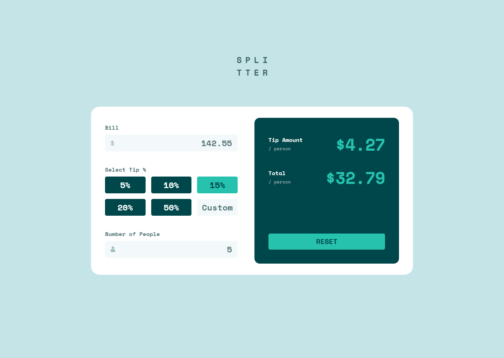

# Frontend Mentor - Tip calculator app solution

This is a solution to the [Tip calculator app challenge on Frontend Mentor](https://www.frontendmentor.io/challenges/tip-calculator-app-ugJNGbJUX). Frontend Mentor challenges help you improve your coding skills by building realistic projects.

## Table of contents

- [Overview](#overview)
  - [The challenge](#the-challenge)
  - [Screenshot](#screenshot)
  - [Links](#links)
- [My process](#my-process)
  - [Built with](#built-with)
  - [What I learned](#what-i-learned)
  - [Continued development](#continued-development)
- [Author](#author)

## Overview

### The challenge

Users should be able to:

- View the optimal layout for the app depending on their device's screen size
- See hover states for all interactive elements on the page
- Calculate the correct tip and total cost of the bill per person

### Screenshot

### Links

- Solution URL: [View solution on Frontend Mentor](https://www.frontendmentor.io/solutions/)
- Live Site URL: [View live site](https://alexander3717.github.io/TipCalculator/)

## My process

### Built with

- Semantic HTML5 markup
- SASS features
- CSS custom properties
- Flexbox
- CSS Grid
- Vanilla JavaScript
- Mobile-first workflow

### What I learned

I learned that `<input>` fields of type `number` are hard to work with if you need a lot of custom validation and restrictions. If I were to build this again from scratch, I'd probably use `<input type="text">` instead.

More importantly I realized that even something simple like this calculator has many edge cases that you don't initially see but have to account for if you want to keep the UX good. You implement one thing and another two problems that need fixing pop up. And in the end it's likely that you forgot something anyways.

Because of this, I think it's worth spending more time planning and describing how the UX should work, maybe making some flow diagram before starting to code. I believe it will reduce the overall time needed to implement the solution.

### Continued development

I'd like to start using external libraries for things like form validation etc., because they will likely handle all the edge cases better and I will have more time to focus on the visual side of the project. It would also give me more practice integrating libraries into my code, which I feel like is a big part of the developer job - not neccessarily coding things from scratch, but taking stuff that someone already made well and making it work within your project.

## Author

- Frontend Mentor - [@Alexander3717](https://www.frontendmentor.io/profile/Alexander3717)
